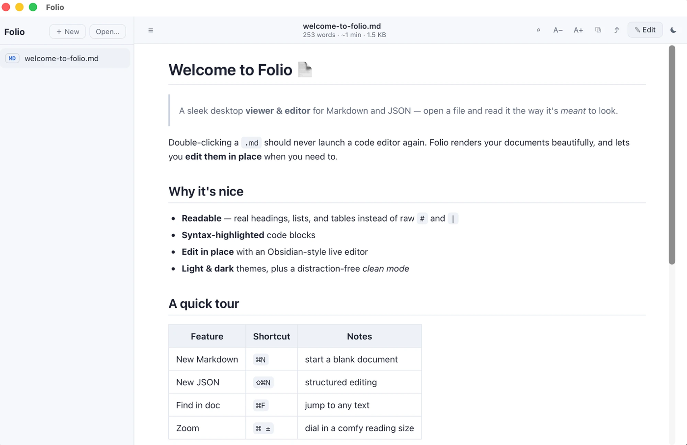
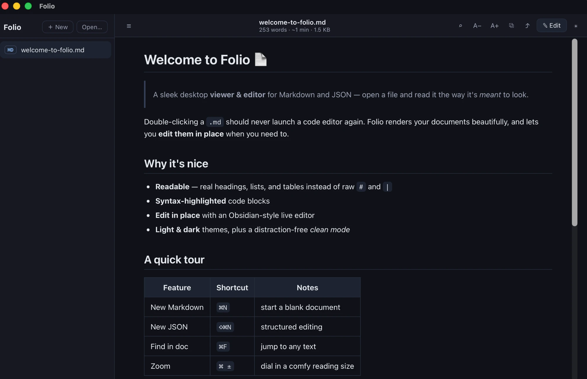
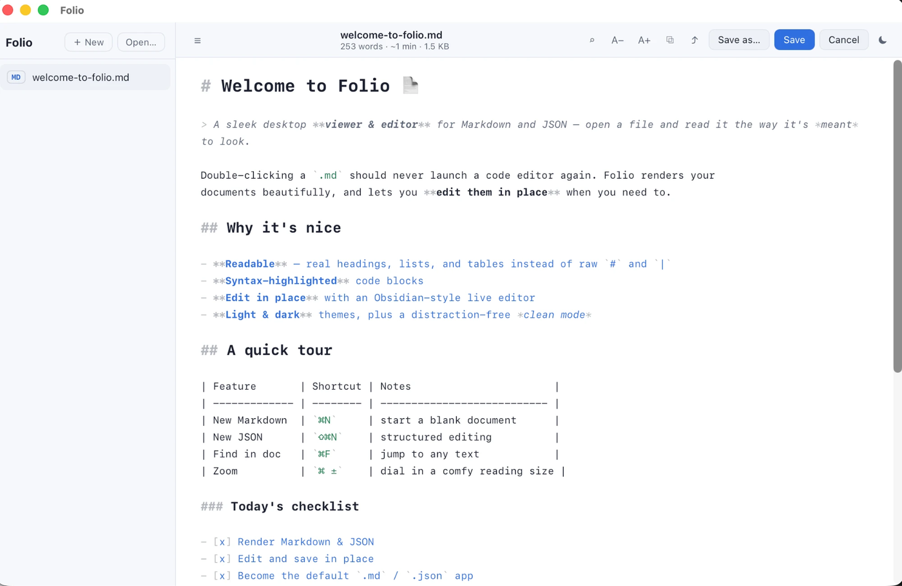

# Folio

[](LICENSE)


**A sleek desktop viewer _and_ editor for Markdown, JSON, and CSV.**

Open a `.md` and it renders as a clean, formatted document — real headings, tables,
and syntax-highlighted code instead of raw `#` and `**` — then edit it in a
**Notion-style WYSIWYG** editor (or flip to a raw source view). Open a `.json` and
explore it as a collapsible, color-coded tree. Open a `.csv` and read it as a real
table — or edit the cells like a tiny spreadsheet. Jump around long docs with a live
**outline**, switch between light and dark, and set Folio as the default app for
`.md` / `.json` / `.csv` so your files open here in a single click.

> ⚠️ **Status:** v0.2 — genuinely daily-usable. macOS-focused.



<table>
  <tr>
    <td width="50%"><br/><sub><b>Dark mode</b></sub></td>
    <td width="50%"><br/><sub><b>Live editing — markers dimmed, headings sized</b></sub></td>
  </tr>
</table>

## Features

- **Markdown, rendered** — GitHub-flavored (tables, task lists) with syntax-highlighted code, plus a live **outline / table of contents** (click to jump; it highlights your place as you scroll)
- **Notion-style editing** — a true WYSIWYG Markdown editor (slash menu, drag-handles, type-to-format — *no* `#`/`**` markers), with a one-click **⌨ Source** toggle back to the Obsidian-style raw editor when you want it
- **JSON, explored** — a collapsible, color-coded tree; fold big nodes, see key/item counts, expand/collapse all, clear "invalid JSON" errors
- **CSV & TSV, as tables** — open delimited data as a clean, aligned table (quoted fields, row numbers, big-file safe) — or **edit it like a spreadsheet** (cells, add/remove rows & columns), saving back to correctly-quoted CSV
- **New files** — `⌘N` (Markdown) / `⇧⌘N` (JSON), or the `＋ New` menu
- **"Open with Folio"** — registers as a handler for `.md`/`.json`/`.csv`; set it as default and double-click opens here, not Xcode
- **Light & dark themes** + a **clean mode** that hides the sidebar for distraction-free reading
- **Find** (`⌘F`), **zoom** (`⌘ ±`), live **stats** (words + reading time, JSON keys, or CSV rows × cols), **Copy**, **Reveal in Finder**
- Sidebar for multiple open files (hover to close), **drag & drop**
- **100% local** — files are read on your machine; no network, no telemetry

## Supported files

| Type | Shown as |
| ---- | -------- |
| `.md` `.markdown` `.mdx` `.mdown` | formatted Markdown + outline |
| `.json` `.jsonc` `.geojson` | collapsible JSON tree |
| `.csv` `.tsv` | aligned, editable table |
| anything else | plain text |

## Make it your default app

```bash
npm run tauri build           # produces Folio.app
```

Move `src-tauri/target/release/bundle/macos/Folio.app` into **/Applications**, then in
Finder: right-click a `.md` → **Get Info** → **Open with: Folio** → **Change All…**
(repeat for `.json` and `.csv`). Now double-clicking those files opens Folio.

## Install / run from source

Prerequisites: [Node.js](https://nodejs.org) 18+ and the
[Rust toolchain](https://www.rust-lang.org/tools/install)
([Tauri prerequisites](https://tauri.app/start/prerequisites/)).

```bash
git clone https://github.com/growthforging/folio.git
cd folio
npm install
npm run tauri dev      # develop
npm run tauri build    # build the .app
```

## Tech

- [Tauri v2](https://tauri.app) — tiny native shell (Rust)
- [React](https://react.dev) + TypeScript + [Vite](https://vite.dev)
- [`react-markdown`](https://github.com/remarkjs/react-markdown) + `remark-gfm` + `rehype-highlight` + `rehype-slug` for rendering & the outline
- [Milkdown](https://milkdown.dev) ("Crepe") for the Notion-style WYSIWYG Markdown editor
- [CodeMirror 6](https://codemirror.net) for the source Markdown / JSON editor
- A hand-rolled collapsible JSON tree + CSV parser/editor ([`src/JsonTree.tsx`](src/JsonTree.tsx), [`src/CsvTable.tsx`](src/CsvTable.tsx))

## License

[MIT](LICENSE)
