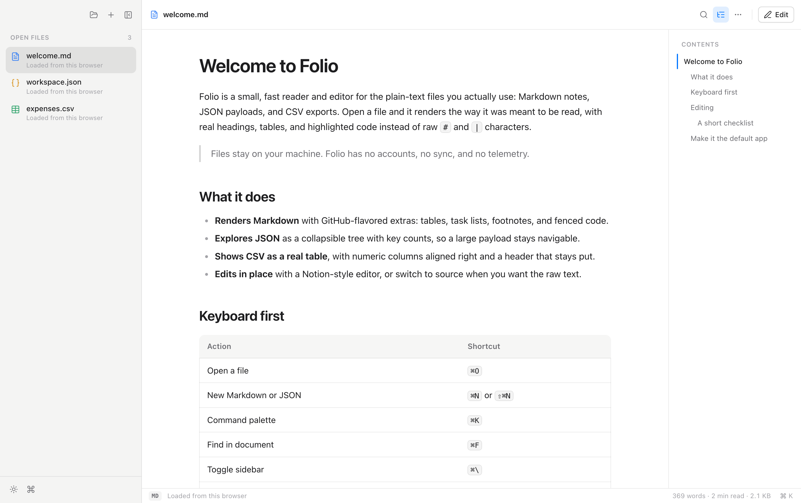
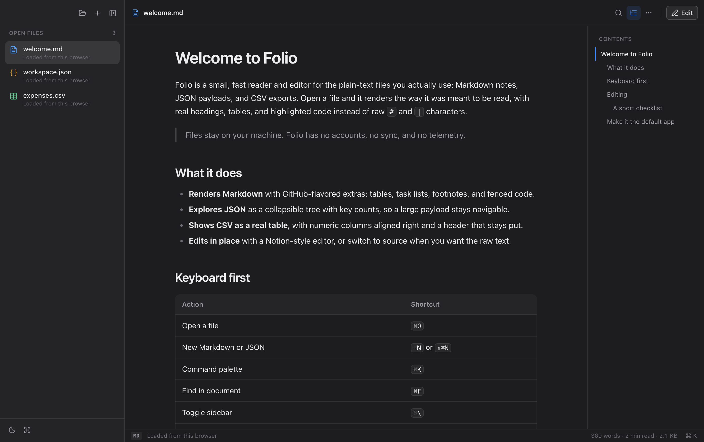
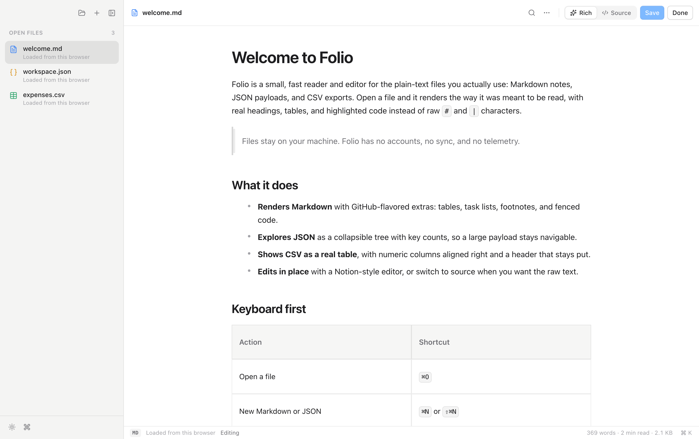
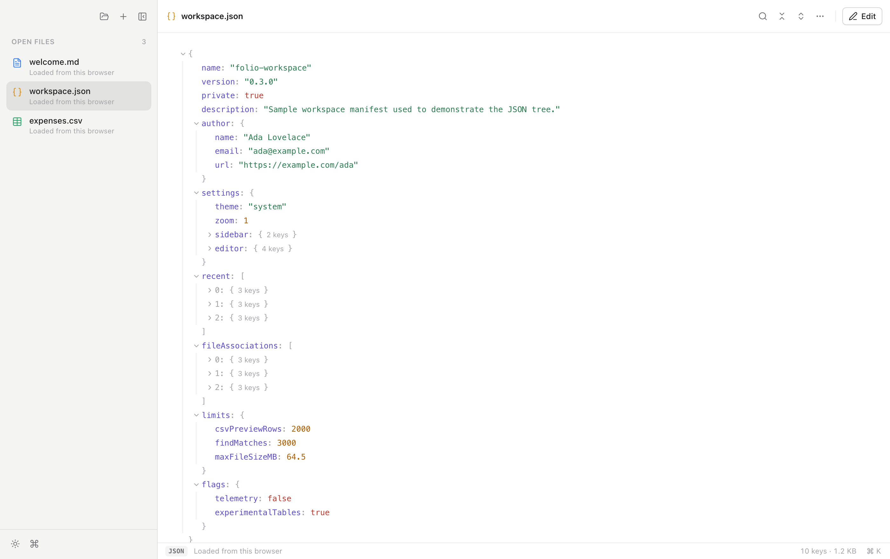
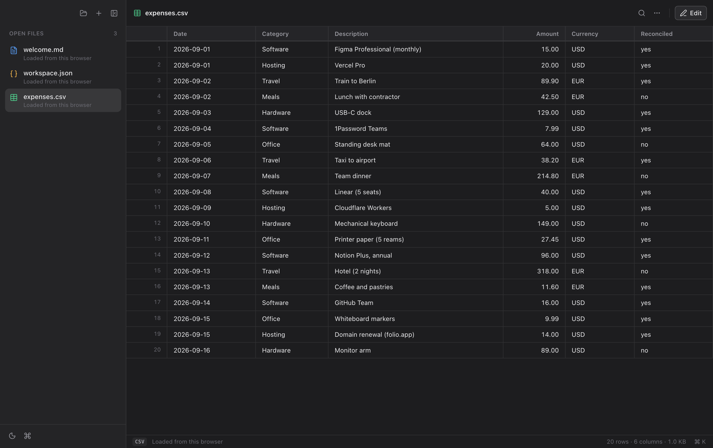

# Folio

[](LICENSE)


**A native macOS reader and editor for Markdown, JSON, and CSV.**

Open a `.md` file and it renders as a document: real headings, tables, task lists, and
highlighted code, with a live outline beside it. Open `.json` and explore it as a
collapsible tree. Open `.csv` and read it as a proper table with numeric columns aligned.
Edit any of them in place, with a Notion-style editor for Markdown (or the raw source), a
grid for CSV, and a code editor for JSON.



<table>
  <tr>
    <td width="50%"><br/><sub><b>Dark appearance</b></sub></td>
    <td width="50%"><br/><sub><b>Notion-style editing, or raw source</b></sub></td>
  </tr>
  <tr>
    <td width="50%"><br/><sub><b>JSON as a collapsible tree</b></sub></td>
    <td width="50%"><br/><sub><b>CSV as a table</b></sub></td>
  </tr>
</table>

<sub>Screenshots come from the browser preview. The native app adds macOS's inset window
controls and a translucent sidebar.</sub>

## What's in the box

- **Reads like a document.** GitHub-flavored Markdown with tables, task lists, footnotes,
  and syntax-highlighted code blocks with a copy button. A contents panel tracks where you
  are and jumps on click.
- **JSON as a tree.** Collapsible nodes with key and item counts, indent guides, and
  one-click copy for any value. Expand or collapse everything from the toolbar.
- **CSV and TSV as tables.** Sticky header, row numbers, numeric columns aligned right,
  quoted fields handled. Edit cells in a grid, add or remove rows and columns, and save
  back as correctly quoted CSV.
- **Edit in place.** A Notion-style editor for Markdown (slash menu, drag handles), or
  flip to source. JSON and plain text get a code editor with search, bracket matching,
  and folding. `⌘S` saves without leaving edit mode; **Done** takes you back to reading.
- **Find in document.** `⌘F` highlights every match and steps through them.
- **Command palette.** `⌘K` lists every action, every open file, and your recent
  documents, with fuzzy search.
- **A native macOS shell.** Inset traffic lights, a translucent sidebar, a real menu bar
  with keyboard shortcuts, native save and confirm dialogs, and "Open with Folio" for
  `.md`, `.json`, and `.csv`.
- **Light, dark, or system appearance.** Switching animates out from the button, and the
  window chrome follows.
- **Recents, drag and drop, zoom, reveal in Finder.** And nothing leaves your machine:
  no accounts, no sync, no telemetry.

## Keyboard shortcuts

| Action | Shortcut |
| --- | --- |
| Open file | `⌘O` |
| New Markdown / New JSON | `⌘N` / `⇧⌘N` |
| Save / Save As | `⌘S` / `⇧⌘S` |
| Edit / Finish editing | `⌘E` / `⇧⌘E` |
| Rich ↔ Source editing | `⇧⌘M` |
| Find in document | `⌘F` |
| Command palette | `⌘K` |
| Toggle sidebar / outline | `⌘\` / `⇧⌘O` |
| Zoom in / out / reset | `⌘+` / `⌘−` / `⌘0` |
| Close document | `⌘W` |
| Reveal in Finder | `⌥⌘R` |

## Supported files

| Type | Shown as |
| ---- | -------- |
| `.md` `.markdown` `.mdx` `.mdown` | formatted Markdown + outline |
| `.json` `.jsonc` `.geojson` | collapsible JSON tree |
| `.csv` `.tsv` | aligned, editable table |
| anything else | plain text |

## Make it your default app

```bash
npm run tauri build           # produces Folio.app
```

Move `src-tauri/target/release/bundle/macos/Folio.app` into **/Applications**, then in
Finder: right-click a `.md` → **Get Info** → **Open with: Folio** → **Change All…**
(repeat for `.json` and `.csv`). Double-clicking those files now opens Folio.

## Install / run from source

Prerequisites: [Node.js](https://nodejs.org) 18+ and the
[Rust toolchain](https://www.rust-lang.org/tools/install)
([Tauri prerequisites](https://tauri.app/start/prerequisites/)).

```bash
git clone https://github.com/growthforging/folio.git
cd folio
npm install
npm run tauri dev      # develop the native app
npm run tauri build    # build the .app
```

`npm run dev` on its own serves a browser preview with sample documents, which is handy
for working on the UI without the Rust toolchain.

## Design notes

Folio borrows its restraint from the system it runs on: the system font, hairline
borders, layered neutral surfaces, and one accent (your macOS accent colour, where the
engine exposes it). Motion is short and purposeful: menus scale in from their anchor,
tooltips travel between neighbouring controls, the sidebar and palette selection glide,
and the theme switch is a circular reveal. Everything respects `prefers-reduced-motion`.

## Tech

- [Tauri v2](https://tauri.app): a tiny Rust shell with an overlay title bar, the macOS
  `sidebar` vibrancy effect, a native menu bar, and file associations
- [React](https://react.dev) + TypeScript + [Vite](https://vite.dev)
- [`react-markdown`](https://github.com/remarkjs/react-markdown) + `remark-gfm` +
  `rehype-highlight` + `rehype-slug` for rendering and the outline
- [Milkdown](https://milkdown.dev) ("Crepe") for the Notion-style Markdown editor
- [CodeMirror 6](https://codemirror.net) for source editing and search
- [Lucide](https://lucide.dev) icons
- Hand-rolled UI: command palette, menus, tooltips, toasts, the JSON tree, the CSV
  parser and grid, find via the CSS Custom Highlight API, and theme changes via the
  View Transitions API

## License

[MIT](LICENSE)
